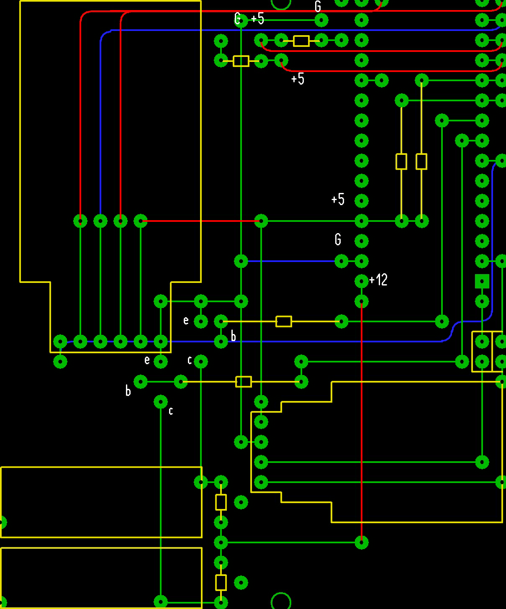
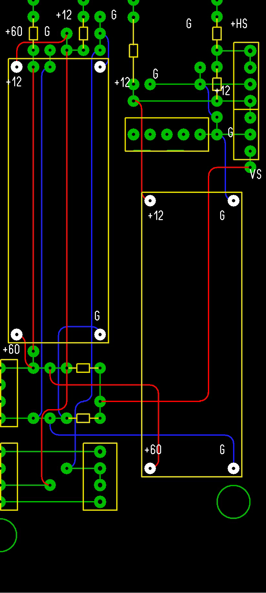

# MaidModule (Arduino)

Module based on the Arduino Nano made with C++, which collects motorcycle data and partially controls peripherals. It is controlled by a special [MaidApp](https://github.com/Ggorets0dev/maid-android-application) written for Android.

    

## Installation

### **Libraries**

> **Warning:** All of the specified libraries must be loaded manually and be visible in the program for downloading sketches. They must also be available at the time of writing the sketch on board

List of third-party libraries used in the sketch:

* [PinChangeInterrupt](https://www.arduino.cc/reference/en/libraries/pinchangeinterrupt/)
* [AltSoftSerial](https://reference.arduino.cc/reference/en/libraries/altsoftserial/)
  
### **Manual**

> **Note:** It is recommended to use Arduino IDE for comfortable compilation and loading

To download the sketch to your Arduino Nano, follow the steps below:

1) Download the source code from the GitHub page using `git clone` or ZIP-archive
2) Download the libraries listed in the manual manually or using the Arduino IDE interface
3) Add libraries to the sketch visibility field by adding files to the required directories (If downloaded manually)
4) Load the sketch (**maid_module.ino**) using the built-in functions of the Arduino IDE

## Assembly

### **Board layout**

Board has a two-level appearance:

*First level of the scheme*

*Second level of the scheme*

Complete board layout is available in the file **board_layout_29.07.2023.lay** file (made in the "Sprint Layout" program)

### **Memory** (SD-card)

> **Note:** Sketch was tested on the parameters specified in the section. Other parameters may be suitable if they meet the conditions of the Arduino library working with memory cards

MicroSD memory card must have the following features:

* Filesystem: FAT16 (FAT)
* Cluster size: 16 KB
* Volume: 1-2 GB

## Connection (Bluetooth)

### **Transfer messages (Sent/Received)**

> **Warning**: Always check that the command codes of the module and the [application](https://github.com/Ggorets0dev/maid-android-application) match when trying to bind, unless you take an official pair. If the codes do not match, it is guaranteed that the binding will not work correctly, because the commands will be interpreted differently on both devices

Messages always start with a **prefix (# $ ?)**, contains **code ( 0 - 6 )** and end with a **separator ( ; )**.

Available prefixes:

* **$** - Command
* **\#** - Entry
* **?** - Empty (no purpose)

Title | Code Value | Prefix | Direction (A - app / M - module) | Template | Description | Example |
|:--------|:--------:|:---:|:-------:|:-------:|:------------|:--------|
| EmptyCode | `0` | `?` | A <-> M | - | Empty message that is created by the constructor to just initialize the variable | - |
| SensorReadingEntry | `1` | `#` | M -> A | speed_voltage | Measured motorcycle speed and battery voltage | #{1}30.15_60.25; |
| StartSensorReadings | `2` | `$` | A -> M | - | Request to start sending sensor readings | - |
| StopSensorReadings | `3` | `$` | A -> M | - | Request to stop sending sensor readings | - |
| ModuleVersionEntry | `4` | `#` | M -> А | major.minor.patch | Requesting a version of a module | #{4}1.2.3; |
| CurrentDatetimeEntry | `5` | `#` | A -> M | dd.mm.yyyy-hh:mm:ss | Data on date and time of initialization (with [MaidApp](https://github.com/Ggorets0dev/maid-android-application)) | #{7}29.07.2023-15:30:45; |
| LaunchModule | `6` | `$` | A -> M | - | Start sensor operation | - |

## Error indicator

When an error occurs in the operation of the sketch, the special yellow LED starts blinking. The interval between the state changes signals a certain error.

| Interval (sec) | Error | Recommendation |
|:-:|:-|:-|
| 1 | Failed to initialize the memory card at the start of the sketch | Check the card for errors and the correct file system, there may be a problem with the contacts |
| 2 | Failed to write data to the memory card during work | Check in the code of the sketch the number of items stored in memory before writing to the memory card, correct the value to a smaller side |

## Coursework

This software (only this repository) was exhibited as a coursework in the 2nd year of the 1st semester of 09.03.03 "Applied Computer Science" in the discipline "Computer Science" at the Moscow Institute of Electronic Technology (MIET). All files related to the coursework can be found in a separate folder with the same name.
